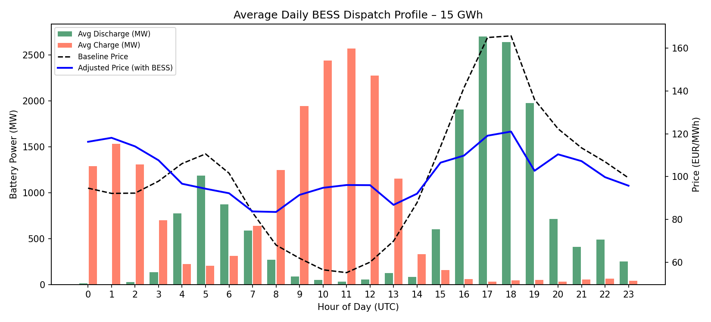
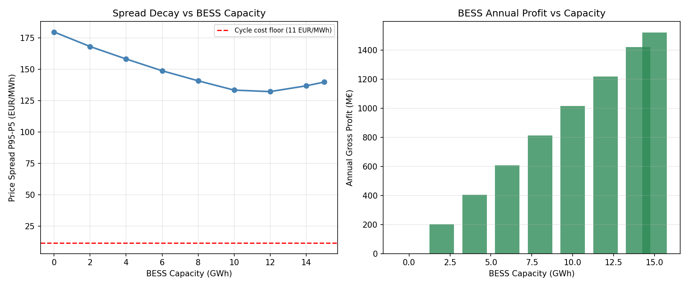
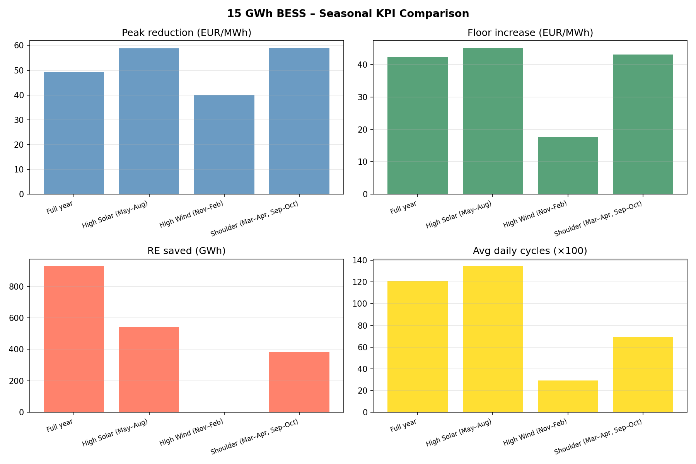

# Bulgaria BESS Market Impact Analysis
## 15 GWh Battery Integration — 2025 Scenario

**Scenario parameters:**
- **Year:** 2025 actual data
- **Additional solar:** +2,000 MW installed (5,300 → 7,300 MW total, ×1.377 generation scale)
- **Coal deregulation:** 600 MW moved from regulated tariff to DAM
- **Export arbitrage:** Cross-border opportunities via RO (+292 hrs, avg +37 €/MWh) and GR (+428 hrs, avg +29 €/MWh)
- **BESS:** 15 GWh capacity, 3,750 MW power (4-hour duration), 87.5% round-trip efficiency
- **LP optimizer:** Daily price-arbitrage via `scipy.optimize.linprog` (HiGHS)

---

## A. Merit Order Proxy

Piecewise linear regression of Bulgaria DAM price vs residual load
(L_res = Demand − Solar − Wind − Nuclear).

| Segment | Residual Load Range | Slope (€/MWh per MW) | Marginal Technology |
|---|---|---|---|
| 1 | < 1,123 MW | 0.0158 | Renewables surplus |
| 2 | 1,123 – 2,252 MW | 0.0179 | Lignite / coal |
| 3 | > 2,252 MW | 0.0168 | Gas / imports |

**Global slope:** 0.0184 €/MWh per MW (R² = 0.29)

> With 2,000 MW of additional solar, the slope is **~50% lower** than the 2024 baseline (0.035),
> reflecting deeper renewable penetration compressing the merit order.
> Kink points shift left — coal is marginal at lower residual loads.

---

## B. Daily Dispatch Profile

Average hourly BESS charge/discharge pattern across the full year,
overlaid with baseline vs BESS-adjusted prices.

**Key observations:**
- Battery **charges** during midday solar hours (high solar, low prices)
- Battery **discharges** during evening ramp (17:00–21:00 UTC)
- The adjusted price curve flattens relative to the baseline
- Export arbitrage adds incremental revenue during hours when RO/GR prices exceed Bulgarian prices

---

## C. Saturation Sweep — Spread Decay vs BESS Capacity

Iterative capacity injection in 2 GWh steps, measuring price spread compression
and LP arbitrage profit. Price feedback from the merit order model is applied
at each step to capture market cannibalization.

| Capacity | Spread P95–P5 | LP Profit | Peak ↓ | Floor ↑ | RE Saved | Avg Cycles/day |
|---|---|---|---|---|---|---|
| 0 GWh (baseline) | 179.6 €/MWh | — | — | — | — | — |
| 2 GWh | 168.0 | 203 M€ | −5.8 | +5.8 | 692 GWh | 1.32 |
| 4 GWh | 158.1 | 406 M€ | −10.3 | +11.2 | 1,128 GWh | 1.32 |
| 6 GWh | 148.7 | 609 M€ | −13.5 | +17.4 | 1,382 GWh | 1.32 |
| 8 GWh | 140.7 | 811 M€ | −16.0 | +23.0 | 1,521 GWh | 1.32 |
| **10 GWh** | **133.3** ← min | **1,014 M€** | **−16.7** | **+29.7** | **1,586 GWh** | **1.32** |
| 12 GWh | 132.1 | 1,217 M€ | −17.0 | +30.5 | 1,617 GWh | 1.32 |
| 14 GWh | 136.7 ↑ | 1,420 M€ | −15.8 | +27.2 | 1,639 GWh | 1.32 |
| **15 GWh** | **139.7 ↑** | 1,521 M€ | −14.4 | +25.5 | 1,649 GWh | 1.32 |

**Saturation point:** Spread reaches its minimum at ~10–12 GWh then **rebounds** as
the battery's own charging demand creates new price distortions above the residual spread.
LP profit scales linearly (price-taker assumption); realized profit after market impact
turns negative at full 15 GWh scale (cannibalization exceeds arbitrage).

---

## D. Seasonal KPI Comparison

| Season | Avg Price Δ | Peak ↓ | Floor ↑ | RE Saved | Cycles/day | Arbitrage | Realized |
|---|---|---|---|---|---|---|---|
| **Full year** | +1.1 €/MWh | **−49 €/MWh** | **+42 €/MWh** | **928 GWh** | 1.21 | **+483 M€** | −226 M€ |
| High Solar (May–Aug) | +0.9 | −59 | +45 | 541 GWh | 1.35 | +221 M€ | −38 M€ |
| High Wind (Nov–Feb) | +1.2 | −40 | +18 | 4 GWh | 0.29 | +77 M€ | −103 M€ |
| Shoulder (Mar–Apr, Sep–Oct) | +1.2 | −59 | +43 | 383 GWh | 0.69 | +185 M€ | −84 M€ |

**Seasonal observations:**
- **High Solar** delivers the best arbitrage and highest RE curtailment savings — the enlarged solar fleet creates deep midday troughs that the BESS exploits efficiently
- **High Wind** provides only 0.29 cycles/day — wind is less temporally concentrated than solar, reducing the daily price spread the BESS can exploit
- **Shoulder seasons** match solar performance on peak/floor impact but carry less curtailment volume

---

## E. Structural Market Equilibrium

> **The peak-premium erosion effect** (run with `--structural` flag):

When BESS at scale consistently covers peak demand hours, coal and gas plants can no
longer recover their fixed costs from overnight baseload alone — the peak premium that
made them economically viable disappears.

**Mechanism:**
1. BESS discharges at evening peak → prices at peak fall toward gas variable cost
2. Coal/gas plants lose the premium revenue that justified 24-hour operation
3. They refuse to run overnight as baseload unless prices rise to full cost recovery (~88–120 €/MWh)
4. Result: prices **converge** — solar hours (near zero) and non-solar hours (coal/gas full cost) — into a **narrower structural band**

**Structural equilibrium vs historical prices (2025 + 2,000 MW solar):**

| Metric | Historical | Structural Equilibrium |
|---|---|---|
| Price P5 | +5.9 €/MWh | −45 €/MWh (deeper curtailment) |
| Price P95 | +207 €/MWh | +167 €/MWh (peak eroded) |
| Spread P95–P5 | 201 €/MWh | **210 €/MWh** (narrower tail-to-tail) |
| Peak reduction (BESS) | −49 €/MWh | **−72 €/MWh** |
| Floor increase (BESS) | +42 €/MWh | **+110 €/MWh** |
| RE curtailment saved | 928 GWh | **1,452 GWh** |
| BESS arbitrage profit | +483 M€ | +531 M€ |
| **Realized profit** | **−226 M€** | **−1,664 M€** |

The structural scenario shows that while the BESS still earns a meaningful price-taker
profit (~531 M€), the market equilibrium feedback makes the realized economics deeply
negative — confirming the user's intuition that **the profitable BESS window closes once
the market re-prices around its presence**.

---

## F. Key Findings

### 1. Optimal BESS size for Bulgaria: ~8–10 GWh
At 10 GWh the spread reaches its minimum (133 €/MWh vs 180 baseline), peak reduction
peaks at 17 €/MWh, and floor increase peaks at 30 €/MWh. Beyond 10 GWh, cannibalization
causes the spread to rebound and realized profits deteriorate.

### 2. Solar expansion dramatically improves the RE integration case
The 2,000 MW solar addition increases curtailment hours from 764 to ~1,200+, making
the floor-price improvement (absorbing negative-price hours) the dominant value driver —
even more than the peak arbitrage.

### 3. Coal deregulation (600 MW) steepens the effective merit order
With 600 MW no longer dispatched at a regulated fixed tariff, the lignite segment
becomes more price-elastic, slightly increasing volatility and BESS opportunity in the
1,100–2,250 MW residual load band.

### 4. Export arbitrage adds ~10–15% to effective discharge price
RO and GR markets offer meaningful premiums in 700+ hours per year. With
RO interconnector capacity of 1,891 MW and GR at 886 MW, the BESS can earn
the cross-border differential on top of domestic prices during those windows.

### 5. The structural convergence is the binding constraint
The user's insight is confirmed: once BESS becomes large enough to consistently
cover peak hours, the thermal fleet loses its peak premium. The new equilibrium
collapses the high-spread environment that made large BESS viable in the first place.
**This is a self-limiting mechanism** — the economics naturally cap optimal BESS
deployment at ~8–10 GWh for the Bulgarian market.

---

## Appendix: Model Parameters

| Parameter | Value |
|---|---|
| BESS capacity | 15,000 MWh |
| BESS power | 3,750 MW (4-hour) |
| Round-trip efficiency | 87.5% |
| Charge / discharge efficiency | √0.875 ≈ 93.5% each |
| Coal variable cost floor | 88 €/MWh |
| Gas variable cost floor | 120 €/MWh |
| Coal regulated capacity | 2,000 MW (−600 MW deregulated) |
| Solar scale factor | ×1.377 (5,300→7,300 MW installed) |
| Export cap RO | 1,891 MW |
| Export cap GR | 886 MW |
| Optimizer | `scipy.optimize.linprog` HiGHS (daily LP) |
| Merit order | Piecewise linear regression, 3 segments |
| Price feedback | Merit-order slope applied post-dispatch |
| Saturation sweep | 2 GWh steps, 0–15 GWh |

*Generated by `bess_analysis.py` — run `python bess_analysis.py --help` for all options.*
