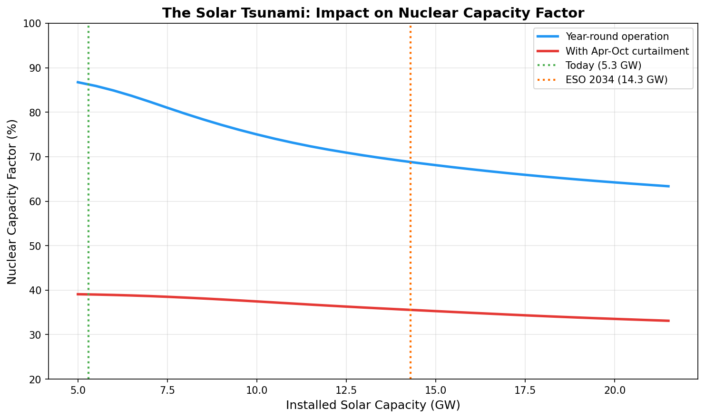
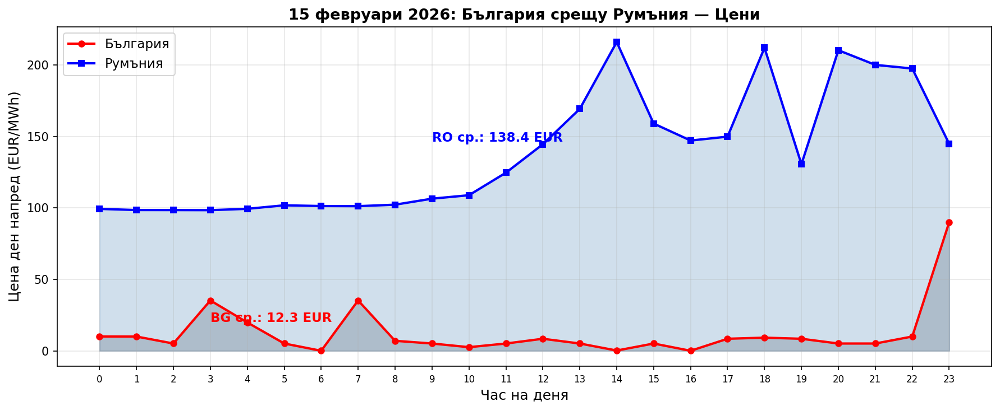
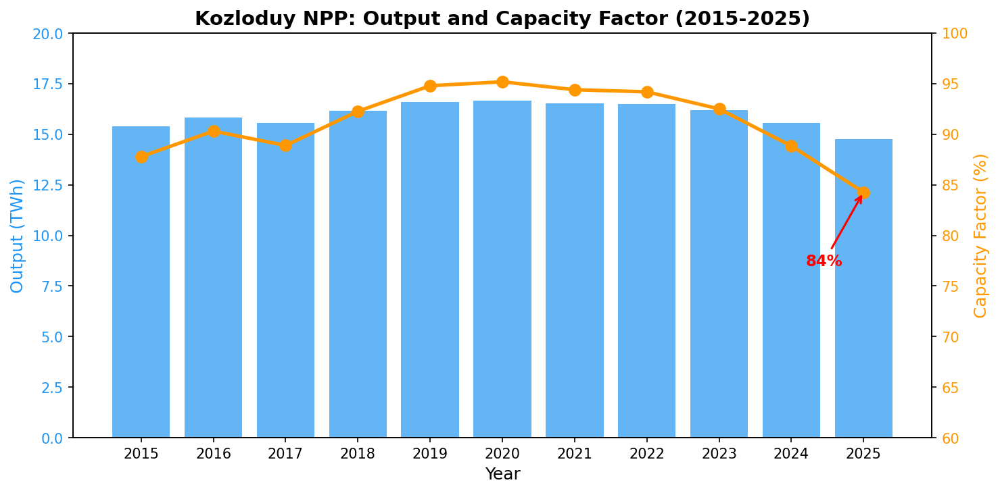
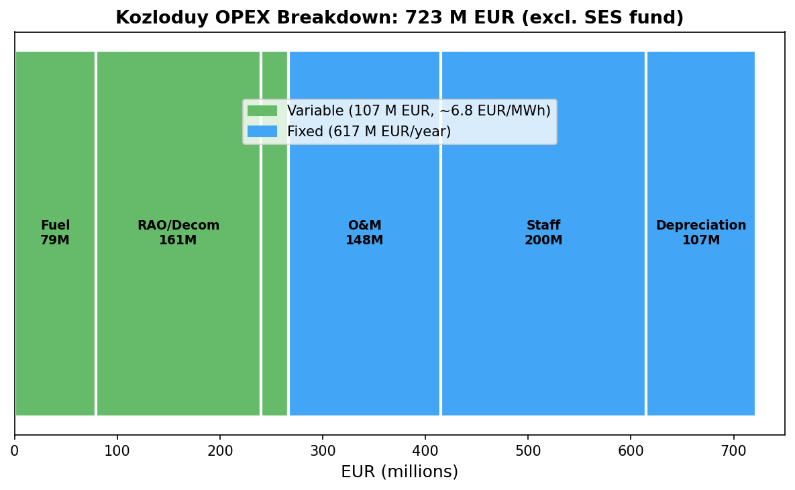
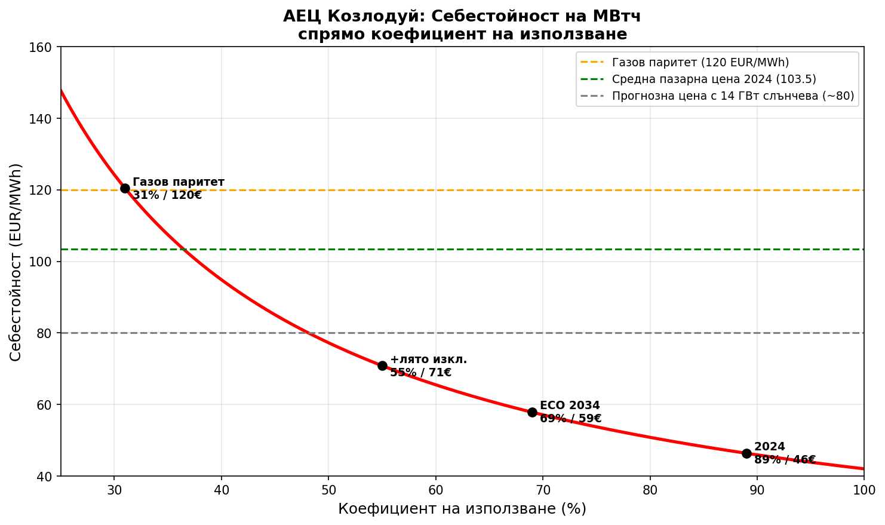

# Slow but Inevitable: The Economic Death of Nuclear in Bulgaria

A nuclear power plant is like a factory with enormous rent and almost no raw material costs. Whether Kozloduy NPP produces one megawatt-hour or sixteen billion of them, it still pays the same salaries to thousands of employees, the same maintenance bills, the same decommissioning contributions, and the same depreciation on its life-extension investments. The actual fuel — uranium — is surprisingly cheap, just a few euros per megawatt-hour.

This cost structure creates a simple but unforgiving economic rule: nuclear power only works if the plant runs **a lot**. The industry measures this as the **capacity factor (CF)** — what percentage of the theoretical maximum the plant actually produces. At 90% CF, the massive fixed costs are spread over a lot of electricity, making each unit affordable. At 50% CF, those same costs are spread over half the output, roughly doubling the price per unit. There's no way around this math.

For decades, Kozloduy's two 1,000 MW reactors ran at 92-95% capacity factor, producing 16+ TWh per year. Electricity was always needed, the plant ran flat out, and the economics were excellent.

That model is now breaking — and the force breaking it cannot be stopped.

**Bulgaria's installed solar capacity has reached 5.3 GW. ESO projects 14.8 GW of new solar and 16 GWh of battery storage by 2034.**

ESO's (the Bulgarian Transmission System Operator) 10-year network development plan lays it out plainly, based on investor intentions already in the pipeline:

> „С ускореното навлизане на ВЕИ и липса на значителен промишлен товар в страната, необходимостта от принудително ограничаване работната мощност на АЕЦ през определени периоди в годината тепърва ще се увеличава."
>
> — ЕСО, Десетгодишен план за развитие на преносната мрежа 2024-2033

*("With the accelerated entry of renewables and the lack of significant industrial load in the country, the need to forcibly limit the operating capacity of the NPP during certain periods of the year will only increase.")*

Bulgaria's participation in the EU Recovery and Resilience Plan will further accelerate this timeline. The investment incentives and regulatory fast-tracking mean the country will likely reach 16 GWh of battery storage and significant solar milestones well before 2034.

**Solar produces for free. When it floods the grid, it pushes prices toward zero — and nuclear has nowhere to hide.**

Nuclear doesn't get physically curtailed by solar — it could keep running. The problem is economic: when solar pushes prices below nuclear's operating cost, every hour the plant runs is an hour it loses money.

Until now, Kozloduy has been partly shielded by the daily price cycle. Even on sunny days, the evening peak (when solar fades but demand stays high) kept average daily prices above nuclear's cost. Nuclear sold cheaply at midday but recovered on the evening peak. With no significant battery storage deployed yet in Bulgaria, this peak-night spread has been nuclear's lifeline.

**That lifeline is about to be cut.**

With 16 GWh of batteries planned (and accelerated by the Recovery and Resilience Plan), batteries will charge during solar midday and discharge into the evening peak — eliminating exactly the price spread that keeps nuclear profitable on sunny days. Once batteries flatten the evening peak, nuclear has nowhere to recover its midday losses.

**In summer 2025, solar already accounts for 25-30% of Bulgaria's electricity generation — and is set to triple.**

Using 2025 actual market data, we can model what electricity prices would look like as solar capacity grows toward ESO's 2034 projections. The analysis uses Bulgaria's measured merit order price elasticity (0.035 EUR/MWh per MW of additional supply) and accounts for coal displacement — extra solar first pushes coal off the grid before compressing prices further. Battery storage (15 GWh) flattens the daily price curve by charging during cheap midday hours and discharging into evening peaks.

An important caveat: the 2025 baseline already understates the problem. During May-August 2025, Unit 6 was offline or running at half capacity for extended periods, reducing nuclear output by 500-900 MW. This lower supply kept prices higher than they would have been with both reactors running. The numbers below are therefore conservative — with both units at full power, summer prices would be even lower.

| Solar capacity | Avg price (EUR/MWh) | Hours below nuclear cost | Hours below zero | Uneconomic months |
|---|---:|---:|---:|---|
| **5.3 GW (2025 actual)** | **100** | **1,505** | **584** | **—** |
| 7 GW + 15 GWh batteries | 99 | 1,534 | 601 | — |
| 10 GW + 15 GWh batteries | 90 | 1,845 | 915 | Jun, Aug |
| **14.3 GW + 15 GWh (ESO 2034)** | **74** | **2,697** | **1,468** | **Jun, Jul, Aug** |
| 20 GW + 15 GWh batteries | 49 | 3,364 | 2,340 | Apr–Sep |

At ESO's projected 14.3 GW of solar with 15 GWh of batteries, the average market price drops to 74 EUR/MWh. During 1,468 hours per year, prices go negative. The entire summer — June, July, August — becomes uneconomic, with average monthly prices below nuclear's operating cost. At 20 GW, six consecutive months (April through September) are uneconomic, and the yearly average itself falls below nuclear's cost.

**Month by month at ESO's 2034 projection, the squeeze leaves nuclear profitable only five months a year.**

| Month | Avg Price (EUR/MWh) | Hours below cost | Hours below zero | Verdict |
|---:|---:|---:|---:|---|
| Jan | 126 | 108 | 16 | ok |
| Feb | 148 | 22 | 1 | ok |
| Mar | 81 | 207 | 72 | ok |
| Apr | 58 | 268 | 133 | marginal |
| May | 52 | 309 | 161 | marginal |
| **Jun** | **37** | **357** | **199** | **uneconomic** |
| **Jul** | **46** | **354** | **177** | **uneconomic** |
| **Aug** | **38** | **346** | **215** | **uneconomic** |
| Sep | 57 | 263 | 139 | marginal |
| Oct | 72 | 194 | 123 | ok |
| Nov | 83 | 135 | 112 | ok |
| Dec | 83 | 134 | 120 | ok |

April, May, and September are marginal — prices hover near nuclear's cost with hundreds of hours below it. June through August are outright uneconomic. Nuclear goes from a year-round money machine to a winter-only generator — but one that still pays fixed costs 12 months a year.

**On February 15, 2026, Bulgaria experienced near-zero electricity prices for almost the entire day — in winter.**

Bulgaria averaged 12.3 EUR/MWh for the day. Meanwhile, interconnector capacity to neighboring countries was fully saturated — Bulgaria couldn't export its surplus at any price.

| Hour | Nuclear (MW) | Coal (MW) | Gas (MW) | Hydro (MW) | Wind (MW) | BG Price |
|---:|---:|---:|---:|---:|---:|---:|
| 00:00 | 1,904 | 1,099 | 313 | 360 | 383 | 10.0 |
| 06:00 | 1,904 | 1,094 | 313 | 770 | 413 | 0.0 |
| 10:00 | 1,904 | 1,118 | 308 | 586 | 196 | 2.5 |
| 14:00 | 1,903 | 1,098 | 313 | 739 | 323 | 0.2 |
| 18:00 | 1,905 | 1,145 | 312 | 1,134 | 288 | 9.2 |
| 22:00 | 1,905 | 1,099 | 320 | 635 | 468 | 10.0 |

The cause: 3,200 MW of must-run generation (nuclear 1,904 + lignite ~1,100 + gas CHP ~310) against ~3,800 MW demand, with 300-470 MW of wind on top. All export interconnectors were at capacity.

This happened with only 350 MW of wind and minimal solar. The grid collapsed into surplus not because of massive renewable generation, but because of nuclear and coal inflexibility. Kozloduy's 1,904 MW runs 24/7. Neither can lignite plants with minimum stable generation requirements.

Compare with Greece on the same day: 3,400 MW of wind, yet prices stayed at 38-142 EUR/MWh. Greece has a flexible gas fleet that ramps down when renewables ramp up. Bulgaria doesn't.

**Nuclear's traditional stronghold is winter. Even that is eroding.**

Greek and Romanian wind competes directly with Bulgarian nuclear during winter months. On windy winter days, regional prices face the same oversupply pressure that solar creates in summer.

In 2024, 20 winter days already had solar peaks above 2 GW in Bulgaria. Some showed prices of 60-69 EUR/MWh — even today's modest solar fleet pushes prices uncomfortably low on sunny winter days. As solar grows, these days become the norm. And on windy winter days, Greek and Romanian wind does the same job.

Nuclear's "safe" selling season is shrinking from both ends — solar eats the shoulder months and summer, regional wind eats into winter.

**The export market that once absorbed Bulgaria's surplus is gone.**

In 2015-2017, Bulgaria could profitably export surplus baseload power to neighbors. Romania is now building its own solar fleet. Greece has massive wind. The neighbors that once absorbed Bulgaria's excess generation are becoming competitors — and their interconnector capacity has limits.

Even if Bulgaria were to freeze all domestic solar and wind construction tomorrow, the problem doesn't go away. Bulgaria, Romania, and Greece form a tightly coupled electricity market — prices typically track within 5 EUR/MWh across the region. Every GW of renewables installed by a neighbor suppresses the regional price that Bulgarian nuclear earns. The solar and wind tsunami is regional, not national. No amount of domestic policy can shield Kozloduy from the price effects of tens of GW of renewables being built across the Balkans and Southeast Europe.

**Meanwhile, Unit 6 is making the problem worse from the other side.**

Between December 2025 and February 2026, Unit 6 experienced multiple unplanned shutdowns. Each outage carries costs beyond lost generation: emergency response, inspection, regulatory delays on restart. In summer 2025, Unit 6 was offline or at half capacity for extended periods — May averaged just 1,064 MW of nuclear output (versus ~2,000 MW at full capacity), and June-August saw frequent dips below 1,000 MW.

The declining capacity factor — driven by Unit 6 reliability issues — is already visible:

| Year | Output (TWh) | CF |
|---:|---:|---:|
| 2019 | 16.6 | 95% |
| 2020 | 16.7 | 95% |
| 2021 | 16.5 | 94% |
| 2022 | 16.5 | 94% |
| 2023 | 16.2 | 93% |
| **2024** | **15.6** | **89%** |
| **2025** | **14.8** | **84%** |

From 16.7 TWh in 2020 to 14.8 TWh in 2025 — a drop of 1.9 TWh (11%) in five years, driven by Unit 6 technical problems. Note that 2025 ENTSOE data is preliminary — the final numbers, once released, are expected to be worse. Less production from the same fixed cost base means the per-unit cost has already risen from ~44 EUR/MWh (at 2020's 95% CF) to ~49 EUR/MWh (at 2025's 84% CF) — a 10% increase with no change in expenses.

**Kozloduy's real operating cost is 723 million EUR per year — and almost all of it is fixed.**

According to Kozloduy's 2024 annual report, operating expenses (excluding the SES fund regulatory levy) break down as follows:

| Category | EUR (M) |
|---|---:|
| Production (fuel, materials) | 79 |
| RAO/decommissioning funds | 161 |
| Grid access fees | 27 |
| O&M | 148 |
| Staff & social security | 200 |
| Depreciation | 107 |
| **Total OPEX** | **723** |

Of this, 617 M EUR is fixed — paid whether the plant runs or not. Only fuel and grid access (~6.8 EUR/MWh) scale with output. This is what makes the capacity factor so critical: same bills, fewer megawatt-hours to divide them by.

| CF | Output (TWh) | Cost (EUR/MWh) |
|---:|---:|---:|
| 92% | 16.1 | 45 |
| **89% (2024)** | **15.6** | **46** |
| 85% | 14.9 | 48 |
| 75% | 13.1 | 54 |
| 69% (ESO 2034) | 12.1 | 59 |
| 55% | 9.6 | 71 |
| 50% | 8.8 | 77 |
| 40% | 7.0 | 95 |
| **31% (gas parity)** | **5.5** | **120** |

Gas parity — where buying gas-generated electricity becomes cheaper than running Kozloduy — arrives at CF 31%. But the real danger isn't reaching that line. It's the squeeze: the average market price nuclear can earn is falling (from 100 today toward 74 at ESO 2034 projections), while its cost per MWh is rising (from 46 today toward 59-71). When the two lines cross, nuclear dies — not because it reached some absolute threshold, but because the market it sells into no longer pays enough to cover its bills.

**This is a death spiral — and Bulgaria is entering it now.**

The pattern is well-documented in every market where renewables have reached critical mass. Solar and wind grow, market prices drop. Revenue falls, but fixed costs stay the same. Prices go negative during more and more hours. The plant shuts down for longer periods. Output drops, costs per unit rise. Regional renewables erode even winter margins. Export markets close as neighbors build their own capacity. And then comes the political choice: subsidize, or close.

Reliability issues and the solar squeeze feed each other. Every unplanned outage pushes costs up, and every GW of solar pushes revenue down. The margin gets thinner from both sides.

**Against this backdrop, Bulgaria is pursuing plans to build two more reactors.**

The project would cost billions of euros with a construction timeline stretching into the mid-2030s. This is like entering a lame, blind horse into a race that it's already late for — and even if it arrived on time, it couldn't win.

**It's late.** New nuclear construction takes 10-15 years. By the time these reactors produce their first MWh, ESO projects 14.8 GW of solar and 16 GWh of batteries will already be on the grid. The market these reactors are designed for will have ceased to exist.

**It's lame.** Nuclear is inflexible. It can't ramp down for sunny afternoons or windy winter nights. In a market dominated by variable renewables, inflexibility is not a feature — it's a fatal flaw. Every hour the reactor can't flex is an hour it bleeds money.

**It's blind.** The project ignores every market signal. Capacity factors falling. Market prices compressing. Neighbors building their own renewables. Export markets saturating. The data is screaming that inflexible baseload has no future in Southeast Europe's integrating electricity market. The project sees none of this.

**It can't win.** Even if built on time and on budget (which no nuclear project in Europe has achieved this century), 4,000 MW of must-run nuclear competing with 14+ GW of near-zero-marginal-cost solar for a national demand that rarely exceeds 6,000 MW is arithmetic that doesn't work. The plant would be born into curtailment.

The billions earmarked for new reactors would yield far greater returns invested in grid flexibility, storage, and interconnection — the infrastructure Bulgaria actually needs.

**Kozloduy NPP is not in immediate danger. But the trajectory is unambiguous.**

Today, at 5.3 GW solar with no batteries, the average market price is 100 EUR/MWh and nuclear is comfortable. At 10 GW solar with 15 GWh of batteries, June and August become uneconomic. At ESO's projected 14.3 GW solar with 15 GWh of batteries, the average price drops to 74 EUR/MWh, the entire summer becomes uneconomic, and April-May-September are marginal — nuclear is profitable only five months a year. At 20 GW, six consecutive months are uneconomic and the yearly average itself falls below nuclear's cost.

The forces driving this — solar deployment, battery storage, regional wind, export market saturation — are all accelerating. None of them are reversible. And none of them can be stopped. Even if Bulgaria froze all domestic renewable construction tomorrow, Greek wind farms, Romanian solar parks, and Turkish capacity additions would continue suppressing regional electricity prices. The Balkans energy market is integrating. Bulgaria cannot wall itself off from the solar and wind tsunami sweeping Southeast Europe. The electricity will flow through the interconnectors, the prices will converge, and the economics of inflexible baseload generation will continue to deteriorate.

The question is not *whether* nuclear economics will collapse, but whether Bulgaria plans proactively — investing in flexibility, storage, and grid modernization — or stumbles into crisis with billions wasted on new reactors that the market doesn't need and physics won't allow to compete.

---

*Analysis based on ENTSOE hourly market data (2015-2026), Kozloduy NPP 2024 Annual Report, and ESO 10-year network development plan 2024-2033 ([eso.bg](https://www.eso.bg/fileObj.php?oid=5402)). All data and scripts available at [github.com/dimivan-dev/nuclear-economics-bg](https://github.com/dimivan-dev/nuclear-economics-bg).*
