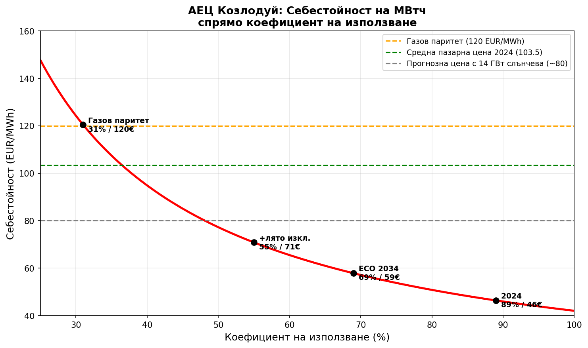
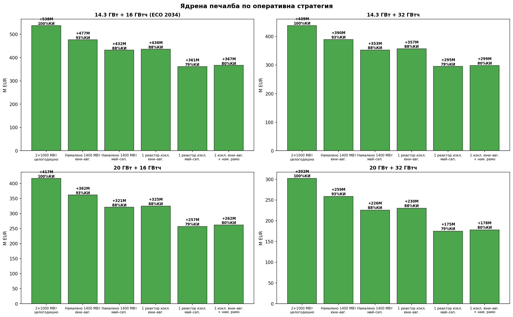
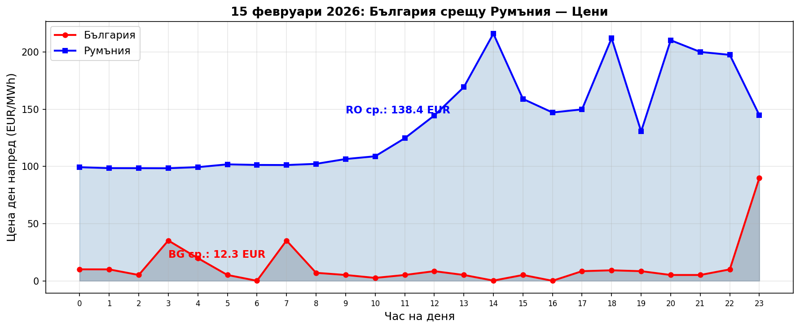

# Бавно, но неизбежно: Икономическата смърт на ядрената енергетика в България

*Въпросът не е дали икономиката на ядрената енергия ще се срине, а дали България планира проактивно — инвестирайки в гъвкавост, съхранение и модернизация на мрежата — или ще се спъне в криза с похарчени милиарди за нови реактори, от които пазарът няма нужда и физиката не позволява да се конкурират.*

---

Атомната електроцентрала прилича на фабрика с огромен наем и почти никакви разходи за суровини. Независимо дали АЕЦ Козлодуй произвежда един мегаватчас или шестнадесет милиона, тя пак плаща същите заплати на хилядите си служители, същите сметки за поддръжка, същите вноски за извеждане от експлоатация и същата амортизация на инвестициите в удължаване на живота си. Самото гориво — уранът — е изненадващо евтино: само няколко евро на мегаватчас.

Тази структура на разходите създава проста, но безпощадна икономическа правило: ядрената енергия работи само ако централата работи **много**. В бранша това се измерва с **коефициент на използване (КИ)** — какъв процент от теоретичния максимум реално се произвежда. При КИ 90% огромните постоянни разходи се разпределят върху много електроенергия и себестойността на единица е приемлива. При КИ 50% същите разходи се разпределят върху половината продукция, което приблизително удвоява цената на единица. Математиката е неумолима.

В продължение на десетилетия двата реактора по 1 000 МВт на Козлодуй работеха с коефициент на използване 92–95%, произвеждайки над 16 ТВтч годишно. Електроенергията винаги беше нужна, централата работеше на пълна мощност и икономиката беше отлична.

Този модел сега се разпада — и силата, която го разрушава, не може да бъде спряна.

**Инсталираният соларен капацитет на България достигна 5,8 ГВт. ЕСО прогнозира 14,8 ГВт нова слънчева и 16 ГВтч акумулаторна мощност до 2034 г.**

Десетгодишният план за развитие на преносната мрежа на ЕСО (Електроенергийния системен оператор) го казва ясно, въз основа на инвеститорски намерения, вече в процес на реализация:

> „С ускореното навлизане на ВЕИ и липса на значителен промишлен товар в страната, необходимостта от принудително ограничаване работната мощност на АЕЦ през определени периоди в годината тепърва ще се увеличава."
>
> — ЕСО, Десетгодишен план за развитие на преносната мрежа 2024-2033

Участието на България в Плана за възстановяване и устойчивост на ЕС допълнително ще ускори тези срокове. Инвестиционните стимули и ускореното регулаторно одобрение означават, че страната вероятно ще достигне 16 ГВтч акумулаторна мощност и ключови слънчеви показатели в рамките на месеци.

**Веднъж изградена, слънчевата енергия произвежда безплатно. Когато залее мрежата, тя бута цените към нула — и ядрената енергия няма къде да се скрие.**

Ядрената енергия не се ограничава физически от слънчевата — централата може да продължи да работи. Проблемът е икономически: когато слънчевата енергия натисне цените под оперативните разходи на АЕЦ, всеки час, в който централата работи, е час на загуба.

Досега Козлодуй беше частично защитен от дневния ценови цикъл. Дори в слънчеви дни вечерният пик (когато слънцето залезе, но търсенето остава високо) поддържаше средните дневни цени над себестойността на АЕЦ. Ядрената централа продаваше евтино по обяд, но компенсираше от вечерния пик. При липсата на значително акумулаторно съхранение в България тази ценова разлика пик–нощ беше животоспасяващата нишка за ядрената енергия.

**Тази нишка е на път да бъде прерязана.**

При планираните 16 GWh батерии (ускорени от Плана за възстановяване и устойчивост) батериите ще се зареждат в слънчевия обяд и ще се разреждат в условията на вечерния пик — елиминирайки точно ценовата разлика, която прави ядрената енергия рентабилна в слънчеви дни. Когато батериите изравнят вечерния пик, АЕЦ няма откъде да компенсира обедните си загуби.

**През лятото на 2025 г. слънчевата енергия вече осигурява 25–30% от електропроизводството на България — и предстои да се утрои.**

Използвайки реални пазарни данни от 2025 г., моделираме цените на електроенергията при нарастване на слънчевия капацитет към прогнозите на ЕСО за 2034 г. Моделът използва емпиричната зависимост на пазарния ред по заслуги (как цените реагират на промени в остатъчното натоварване), отчита ограничаването на слънчевото производство (операторите изключват панели вместо да приемат отрицателни цени) и моделира влиянието на батериите чрез ежедневен енергиен баланс — батериите се зареждат от нулевите слънчеви часове и се разреждат в пиковите часове, структурно тавайки вечерните цени.

Важна уговорка: базовата линия от 2025 г. вече подценява проблема. В периода май–август 2025 г. Блок 6 беше спрян или работеше с наполовина намален капацитет продължително, с което ядреното производство намаля с 500–900 МВт. Това по-ниско предлагане поддържаше цените по-високи, отколкото биха били при двата работещи реактора. Числата по-долу са следователно консервативни.

При прогнозираните от ЕСО 14,3 ГВт слънчева мощност и 16 ГВтч батерии шест месеца в годината (от април до септември) имат средни цени под оперативната себестойност на АЕЦ от 46 EUR/MWh. Юни и август падат до 28–29 EUR/MWh. При 32 ГВтч батерии (които пазарът неизбежно ще изгради с нарастването на арбитражната възможност) юни пада до 15 EUR/MWh. Зимните месеци се задържат над 70 EUR/MWh, но лятното сриване дърпа годишната средна до 53 EUR/MWh — само 7 EUR/MWh над себестойността на АЕЦ.

Спирането на реактор за лятото не помага — намалява приходите повече, отколкото пести от променливите разходи, защото пределната цена на производство (7 EUR/MWh) е далеч под дори потиснатите летни цени. Всяка стратегия за ограничаване носи по-малко от работата на пълна мощност.

При 20 ГВт слънчева и 32 ГВтч батерии ядрената енергетика навлиза в зоната на трайна загуба. Никоя оперативна стратегия — пълна мощност, намалена мощност, спрян реактор — не носи печалба. Загубата достига 73–105 млн. EUR в зависимост от стратегията. Дори при 20 ГВт само с 16 ГВтч батерии маржът е на ръба: +63 млн. EUR при пълна мощност, но отрицателен при спиране на един реактор за лятото.

**Това е смъртна спирала — и България вече я навлиза.**

Моделът е добре документиран на всеки пазар, където ВЕИ са достигнали критична маса. Слънчевата и вятърната мощност нарастват, пазарните цени падат. Приходите намаляват, а постоянните разходи остават същите. Все повече часове се сриват до нула, докато слънчевата залива мрежата. Батериите изравняват оставащия пик. Централата спира за по-дълги периоди. Производството пада, себестойността на единица расте. Регионалните ВЕИ ерозират дори зимните маржове. Износните пазари се затварят, докато съседите изграждат собствен капацитет. И тогава идва политическият избор: субсидии или затваряне.

Проблемите с надеждността и слънчевия натиск се подхранват взаимно. Всяко непланирано спиране вдига разходите, а всеки ГВт слънчева мощност свива приходите. Маржът се стеснява от двете страни.

**Батериите не просто прехвърлят енергия — те трайно унищожават пиковата премия.**

В слънчеви дни цените падат по обяд, но се възстановяват вечер — АЕЦ продава евтино по пладне, но печели от пика. При 16 ГВтч батерии, заряждани от безплатна слънчева и разреждани вечер, тези пикови часове се таванират при пълната себестойност на въглищата (88 EUR/MWh). При 32 ГВтч батериите покриват по-голямата част от нощта, сривайки цените до цената им на цикъл (~15 EUR/MWh). Ценовата разлика се трансформира от времеви арбитраж (купи евтино по обяд, продай скъпо вечер) в технологичен арбитраж: батериите печелят от разликата в разходите между слънчевата (~0 EUR/MWh) и въглищата (~88 EUR/MWh). АЕЦ, захваната между тях, не може да продава нито от едната, нито от другата страна на тази нова разлика.

**Износният пазар, който някога поглъщаше излишъка на България, вече го няма — а самата централа е под натиск отвътре.**

Преди слънчевия бум България можеше да изнася изгодно базова мощност към съседите. Румъния сега изгражда собствен слънчев парк. Гърция разполага с огромна вятърна мощност. Дори ако България замрази утре цялото вътрешно строителство на ВЕИ, проблемът не изчезва. България, Румъния и Гърция образуват тясно свързан електроенергиен пазар — цените обичайно се движат в рамките на 5 EUR/MWh в целия регион. Цунамито от слънчева и вятърна енергия е регионално, не национално.

Надеждността на централата се влошава паралелно. В периода декември 2025 – февруари 2026 г. Блок 6 претърпя множество непланирани спирания. През лятото на 2025 г. той беше спрян или работеше с наполовина капацитет продължително — средното ядрено производство за май беше едва 1 064 МВт (спрямо ~2 000 МВт при пълна мощност). Производството е паднало от 16,7 ТВтч през 2020 г. до 14,8 ТВтч през 2025 г. — спад от 1,9 ТВтч (11%) за пет години. Важно е, защото оперативните разходи на Козлодуй са 723 млн. EUR годишно — и почти всички са постоянни. Съгласно годишния отчет за 2024 г. 617 млн. EUR са постоянни — платими независимо дали централата работи или не. Само горивото и достъпът до мрежата (~6,8 EUR/MWh) се променят с производството. Всеки изгубен MWh разпределя тези постоянни разходи върху по-малко продукция.

Двата реактора ВВЕР-1000 на Козлодуй не могат да регулират мощността си в съответствие с почасовото натоварване — те не са проектирани за следене на товара. Могат да намалят производството до около 70% (и двата по ~700 МВт, или общо 1 400 МВт) или да спрат напълно един реактор (~1 000 МВт). Това са единствените реалистични варианти за ограничаване.

**Традиционният бастион на АЕЦ е зимата. Дори той се рони.**

Гръцкият и румънският вятър се конкурират пряко с българската атомна енергия през зимните месеци. В ветровити зимни дни регионалните цени са изправени пред същия натиск на свръхпредлагане, какъвто слънчевата енергия създава лятото. „Безопасният" сезон за продажби на АЕЦ се свива от двата края — слънчевата поглъща преходните месеци и лятото, регионалният вятър навлиза в зимата.

**На 15 февруари 2026 г. България отчете цени близо до нула за почти целия ден — и то зимата.**

България средно отчете 12,3 EUR/MWh за деня. Междувременно капацитетът на интерконекторите към съседните страни беше напълно изчерпан — България не можеше да изнесе излишъка си на никаква цена. Причината: 3 200 МВт задължително производство (АЕЦ 1 904 + лигнит ~1 100 + газова КТЦ ~310) срещу ~3 800 МВт търсене, с едва 300–470 МВт вятър отгоре.

Това се случи при минимални ВЕИ. Мрежата се срина в излишък заради негъвкавостта на АЕЦ и въглищата. За сравнение: в Гърция същия ден имаше 3 400 МВт вятър, а цените се задържаха на 38–142 EUR/MWh. Гърция разполага с гъвкав газов парк, който намалява мощността, когато ВЕИ нарастват. България — не.

**На този фон България преследва планове за изграждане на още два реактора.**

Проектът ще струва милиарди евро с времева рамка за строителство, простираща се до средата на 30-те години. Това е като да вкараш куц, сляп кон в надбягване, за което вече е закъснял — и дори да пристигне навреме, не може да спечели.

**Закъснял е.** Новото ядрено строителство отнема 10–15 години. Когато тези реактори произведат първия си MWh, ЕСО прогнозира, че на мрежата вече ще има 14,8 ГВт слънчева и десетки ГВтч батерии. Пазарът, за който са проектирани тези реактори, ще е престанал да съществува.

**Куц е.** Ядрената енергия е негъвкава. Не може да намали мощността за слънчеви следобеди или ветровити зимни нощи. На пазар, доминиран от ВЕИ, негъвкавостта не е предимство — тя е фатален недостатък. Всеки час, в който реакторът не може да се нагоди, е час, в който той губи пари. А дори и да се нагоди, това не помага за покриване на огромните капиталови разходи.

**Сляп е.** Проектът игнорира всеки пазарен сигнал. Коефициентите на използване падат. Пазарните цени се свиват. Съседите изграждат собствени ВЕИ. Износните пазари се насищат. Данните крещят, че негъвкавата базова мощност няма бъдеще на интегриращия се електроенергиен пазар в Югоизточна Европа. Проектът не вижда нищо от това.

**Не може да спечели.** Дори изграден навреме и в рамките на бюджета (което не е постигнал нито един ядрен проект в Европа през този век), 4 000 МВт задължителна ядрена мощност, конкурираща се с 14+ ГВт почти нулева пределна слънчева енергия за национално търсене, рядко надхвърлящо 6 000 МВт — е аритметика, която не работи. Централата ще се роди в режим на ограничаване.

Милиардите, заделени за нови реактори, биха донесли много по-голяма възвращаемост, ако бъдат инвестирани в мрежова гъвкавост, съхранение и интерконекция — инфраструктурата, от която България действително се нуждае.

**АЕЦ Козлодуй не е в непосредствена опасност. Но траекторията е недвусмислена.**

Днес, при 5,8 ГВт слънчева и без батерии, средната пазарна цена е 101 EUR/MWh и АЕЦ печели комфортните 1 007 млн. EUR. Добавете 16 ГВтч батерии — без никаква нова слънчева — и тази печалба се преполовява до 518 млн. EUR, тъй като батериите таванират вечерния пик. При 10 ГВт слънчева с батерии печалбата пада до 308 млн. EUR. При прогнозираните от ЕСО 14,3 ГВт с 16 ГВтч батерии печалбата се свива до 182 млн. EUR — комфортно на хартия, но марж от 25% върху база от разходи 735 млн. EUR не оставя пространство за грешка. При 32 ГВтч батерии АЕЦ едва излиза на нула с 82 млн. EUR. При 20 ГВт + 32 ГВтч навлиза в трайна загуба.

Силите, движещи това — внедряване на слънчева енергия, акумулаторно съхранение, регионален вятър, насищане на износните пазари — се ускоряват. Нито една от тях не е обратима. Нито една не може да бъде спряна. Дори ако България замрази цялото вътрешно строителство на ВЕИ утре, гръцките вятърни паркове, румънските слънчеви паркове и турските допълнителни мощности ще продължат да потискат регионалните цени на електроенергията. Балканският енергиен пазар се интегрира. България не може да се огради от слънчево-вятърното цунами, заливащо Югоизточна Европа. Електричеството ще тече през интерконекторите, цените ще се изравнят и икономиката на негъвкавото базово производство ще продължи да се влошава.

---

*Анализът е базиран на почасови пазарни данни на ЕНТСО-Е (2015–2026), годишния отчет на АЕЦ Козлодуй за 2024 г. и Десетгодишния план за развитие на преносната мрежа на ЕСО 2024–2033 ([eso.bg](https://www.eso.bg/fileObj.php?oid=5402)). Пълни таблици с данни в [analysis_tables.md](analysis_tables.md). Всички данни и скриптове са достъпни на [github.com/dimivan-dev/nuclear-economics-bg](https://github.com/dimivan-dev/nuclear-economics-bg).*
